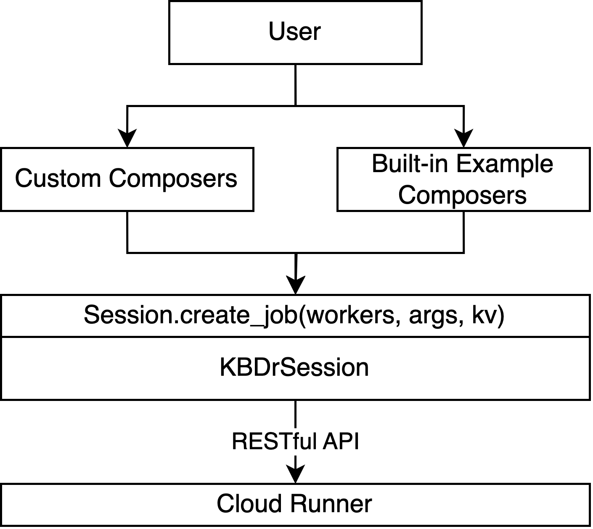

# kcomposer

A Python library that helps researchers compose testing jobs on KBDr-Runner.

## Usage

Make sure your clone is up-to-date:

```shell
cd ./KBDr-Runner/kcomposer
pip install -r requirements.txt
```

Create Python scripts at the `kcomposer` folder to compose your tasks.

## Overview



### Example Composers

There're builtin composers that support bug reproduction and cross reproduction. You can specify the bug dump folder and functions like `` will compose the list of workers, job arguments and KV labels for you. With the job info composed, you can send the job to the server.


